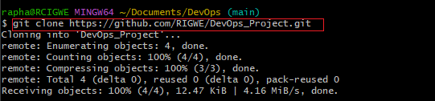

# git Project
The basic Git Projects are allocation of begineer friendly tasks designed to introduce participants to the fundmentals of Git, `a powerful version control system` widely used in software development.

## Initializing a Repository and Making Committ

### Initializing a Repository and Making Committ

Git Introduction

Git is a distributed version control system. Git solves the problem of sharing source code efficiently and keeping track of changes made to source code.

Git allows developers make their own copy of the central repository and this is why it is referred to as a `Distributed Version Control System`

#### Initializing a Git Repository

Making your first commit

## Working With Branches

Make First Git Branch

Git Branch helps create a different copy of your source code. 

inthe new brach, changes can be made as much as you want. the changes are independent of what is in the main copy.

Git Branch is `commonly used to develop new feature of your application`, and that `the initial code is untested` and as such can not be added to the code base of your live application

Listing your git branches and changing into old branch

Merging a Branch into another Branch.

## Colaboration and Remote Repositories

Pushing Your Local git repository to your remote github repository

## Clonning Remot Git Repository

We need a local copy of our remote repository.

Best Practice dictates we copy our local story locally in the local machine  and git clone command is the key to this.

The `git clone` command helps us `make a copy of remote repository` in our local machine.

## Branch Management and Tagging

Introduction to Markdown Syntax

A lightweight mark up language widely used for `formatting plain text`
It allows you to add formatting elements to you text without making it complex such as HTML or othert formating languages.

Its Commonly used `for creating documents README files, forum posts, and web pages`

1 Headings

# Heading 1

## Heading 2

### Heading 3 

2 Emphasis

*italic* or _italic_

**bold** __bold__

3 Lists: markdown has support for both ordered and unordered list

unordered list example

 - Item 1 
- Item 2
- Item 3

ordered list 

 1. First item

2. Second item 

3. Third item

4 Links

[visit darey.io](https://www.darey.io)

5 Images 

6 Code

`console.log('Welcome to darey.io')`

These are the most commonly used markdown syntax elements.

