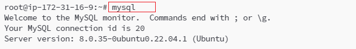
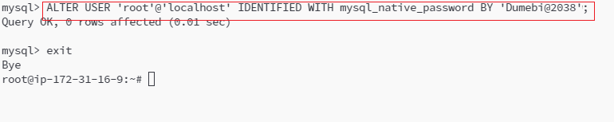
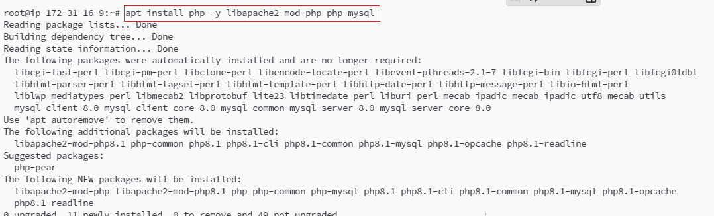
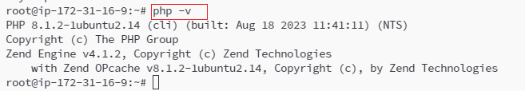
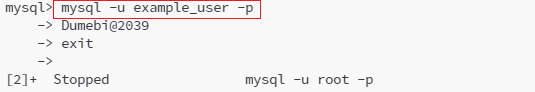
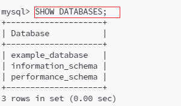
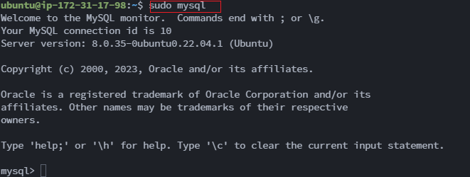

# WEB STACK IMPLEMENTATION (LAMP STACK) IN AWS

## Lamp Stack Project

The Project `"Lamp Stack"`delve into advanced topics such as performance optimization, debugging, and deployment of strategies.

There are different stack of technologies that make different solutions possible.
These stack of technologies are regarded as `WEB STACKS` Examples include `LAMP, LEMP, MEAN and MERN`stacks.

### A Technology stack
is a set of frameworks and tools used to develop a softwre product.
These set of framework and tools are specifically chosen to work together in creating a well-functioning software. They are acronyms for individual technologies used together for a specific technology product. Examples are Below.

- __LAMP__ (Linux, Apache, MySQL, PHP or Python, or Perl)
- __LEMP__ (Linux Nginx, MySQL, PHP or Python, or Perl)
- __MERN__ (MongoDB, ExpressJS, ReactJS, NodeJS)
- __MEAN__ (MongoDG, ExpressJS, AngularJS, NodeJS)

# Installation of LAMP

## How to Install 

LAMP a group of open source software that is typically installed together in order to enable a server to host dynamic websites and web- apps written in PHP. 

Process

Step 1 - Installing Apache and Updating the Firewall

The Web server start service immediately it's installed as a default

To Test if it Works

Apache 2 is active and Running

Another test to see it running, we open up Port 80 

We have to open security group in EC2

The server Public IP address was typed into web browser to verify that server is running. 

Step 2 - Installing MySQL

We Have a server running, we nned a database to work with it. MySQL a popular database management system used within PHP environments.

)

Step 3 - Installing PHP

We Have apache to serve the content and MySQL to store and manage the data. PHP is the component of the setup that will process code to display dynamic contentto the final user.

Step 4 - Creating a Virtual Host for your Website

Step 5 - Testing PHP Processing on Web Server

Connection Between PHP and Apache produce this.

Step 6 - Test Database connection from PHP 

Database Create and Test

New User Permission Test

Show Database

Creating a table

# WEB STACK IMPLEMENTATION (LEMP STACK) IN AWS

The LEMP software stack is a group of software that can be used to serve dynamic web pages and web applications written in PHP. This is an acronym that describes a Linux operating system, with an Nginx (pronounced like “Engine-X”) web server. The backend data is stored in the MySQL database and the dynamic processing is handled by PHP.

Install nginx

Step 2 - installing MySQL

Step 3 - Installing PHP

Step 4 - Configuring nginx to Use the PHP Processor 

Step 5 - Testing PHP with Nginx

