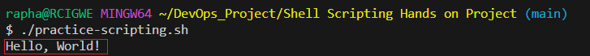

# Shell Scripting Hands on Project

## Understanding the Shell

The shell is a command-line interface that allows users to interact with the operating system. It acts as a bridge between the user and the kernel, enabling users to execute commands, run programmes, and perform various tasks by typing `text-base commands`.The shell interpretes these commands and communicates with the operating system to exedcute them.

## Types of shell

    1. Bash (Bourne Again Shell): Used widely for many Linux distributions. It is powerful versatile with extensive scripting capabilities.

    2. Sh (Bourne Shell): Originally a Unix shell, its the basis for many other shells. provides basic functionality for executing commands

    3. Ksh (Korn Shell): An advanced shell incorporating both Bash and Sh features, ofering powerful scripting capabilities

    4. Zsh (Z Shell): A shell with advanced scriptingfeatures and interactive command-line, highly customizable

## Introduction to Shell Scripting

Shell scripting is writing a series of commands in a `plain text file`, known as known as a `shell scrit`  

Its used by, System administrators, Developers, DevOps professionals.

Its features are: Variables, Control Structures, Functions, Redirection and Pipes, Error Handling.

## Basic Structure of a Shell Script

A shell script which is a sequence of shell commands written in a plain text file starts with a `shebang` line (#!/bin/bash)

For Example: #!/bin/bash 

### Comments 

Comments Starts with # synbol, they are ignored by the shell, but used to document the script making it easier for others (and my future self) to understand the code.

For example 

### Variables and User Input
For example 

### User Input obtained using `read` command 

### Conditional Statements

Shell scripts use conditional statements to make decisions and execute different code blocks 
based on conditions. The basic syntax for an if-else statement is as follows:

### Loops

Loops are fundamental constructs that allow execution of a set commands repeatedly.
They are essential for automating repetitive tasks, processiong data and iterating over collections of items.

For Loop

### Shell Scripting

The following Scripts creates ten Ubuntu user accounts

Loop to create ten user accounts

### Creating Back up of Files and Directories

1. Configuration:
• backup_dir: Specifies the directory where the backup file will be saved.
• source_dir: Specifies the directory or files you want to back up.
• backup_file: Generates a backup file name with the current date and time.
2. Backup Creation:
• tar -czf $backup_dir/$backup_file $source_dir: Uses tar to create a 
compressed archive (tar.gz) of the specified source directory or files and saves 
it in the backup directory.
3. Check Backup Status:
• After creating the backup, the script checks the exit status of the tar command. 
If the exit status is 0 (indicating success), it displays a success message. 
Otherwise, it shows a failure message

Example:

Back Up was successfully created 

