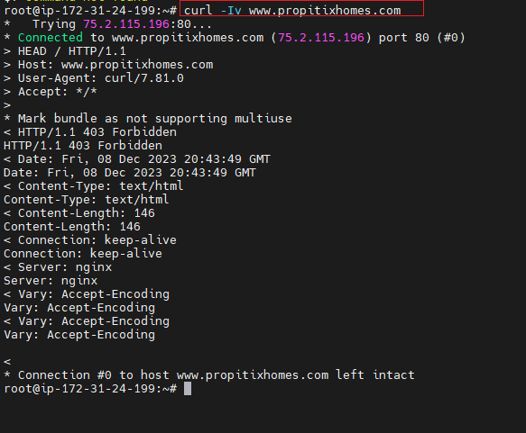

# Client-Server Architecture with MySQL as RDBMS

The client Server refers to an erchitecture in which two or more Computers are connected together over a network to send and receive requests between one another.
During communication, each machine has its own role to play: the request sending machine is referred to as `"Client"` and the responding machine (serving) is called `"server"`.

## Implement a Client Server Architecture Using MySQL Database Management System (DBMS)

Following these Steps:

1. In Performing this, two linux-based virtual servars        (EC2 instances in AWS) were created.

2. 1st Server was named mysql-server while the second was named mysql-client in AWS instances.

3.  On Mysql-server, MySQL Server software was installed and on Mysql-client, MySQL Client software was installed.

4. Since by Default, both EC2 virtual servers were located on the same virtual nework, so they communicate to each other using `local IP address`  Using mysql server's local IP address to connect from mysql client.

MySQL server uses TCP port 3306 by defaault, so we will have to open it by creating a new entry in `Inbound rules` in `mysql server` Security Groups as below. 

5. Will need to configure MySQL server to allow connections from remote hosts.

As below

6. Connecting Linux Server Remotely to mysql server  Database Engine without SSH. Using mysql utility to perform this task.

End.